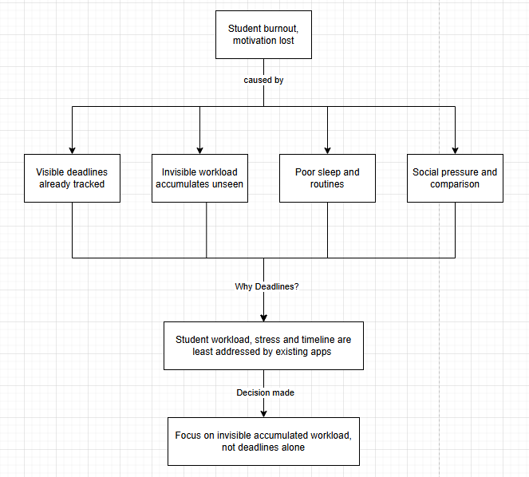

# Deadlines by [Team Name]

> **See the pressure coming. Adjust before it hits.**

**Team:** [Member 1], [Member 2]  
**Problem Statement:** Lifestyle Track — Beating the Burnout: Stress & Workload Manager  
**Video Presentation:** [Unlisted YouTube Link]  
**Presentation Slides:** [Public Link]  
**UI Prototype:** [Public Link]

---

# 1. Project Overview

## The Problem

University students rarely burn out because of one single task. Pressure accumulates across assignments, exams, part-time work, projects, errands, social commitments and personal responsibilities until the combined workload becomes difficult to see and harder to control.

Calendars and task managers show **what** needs to be done and **when**, but students still have to mentally estimate the combined strain created by overlapping commitments. By the time overload becomes obvious, they may already be exhausted.

Our main stakeholders are university students balancing academic work with other responsibilities. We focus on three gaps: workload becomes visible too late, prioritisation becomes reactive, and existing tools can describe pressure without helping the user decide what can realistically change.

## Our Solution

**Deadlines** is a mobile-first workload forecasting and rebalancing tool. It turns commitments into a visual timeline, detects periods where difficult responsibilities converge, adapts today's interpretation to the user's available capacity, and helps the user make a realistic adjustment before pressure becomes burnout.

The core loop is **See → Understand → Adjust → Recover**.

### Feature Set

- Day / Week / Month visual workload timeline
- Manageable, Busy, Strained and Overloaded pressure forecasting
- Daily capacity check-in: Running Low / Okay / Good
- Pressure-zone drill-down showing contributing commitments
- Category, priority, difficulty and flexibility metadata
- Explainable what-if rebalancing preview before changes are applied
- Recovery-window identification and protection
- Commitment creation, details and completion
- Planned Outlook / Teams / calendar ingestion for lower manual effort
- Planned meaningful notifications/widgets for a low-attention experience

---

# 2. Ideation & Process

## 2.1 Ideas We Considered

| Idea | Why it was dropped / kept |
|---|---|
| **Workload pressure timeline (Chosen)** | **Kept.** Makes workload convergence visible across time and became the core interaction. |
| **Pressure forecasting (Chosen)** | **Kept.** Shows *when* workload becomes difficult rather than only counting tasks. |
| **What-if rebalancing (Chosen)** | **Kept.** Turns the product from a passive visualiser into a decision-support tool. |
| **Daily capacity check-in (Chosen)** | **Kept.** The same objective workload can feel different depending on the user's available capacity that day. |
| **Recovery protection (Chosen)** | **Kept.** Responds directly to the need to move users toward recovery, not only productivity. |
| **Runner metaphor (Chosen, simplified)** | **Kept but simplified.** Early versions used multiple runners. This was ambiguous, so the concept evolved toward one runner representing the user's aggregate strain. |
| Simple deadline lines | **Dropped as the final concept.** Too similar to conventional calendar/timeline products and did not explain strain. |
| Generic stress / mood tracker | **Dropped as the core.** It reports how the user already feels but does not sufficiently predict or rebalance future workload. |
| Full AI task planner | **Deferred.** Too broad and opaque for the MVP. We use a deterministic workload engine so decisions remain explainable. |
| Heavy gamification | **Dropped.** XP, levels and rewards risked making workload management another obligation. |
| Outlook / Teams / calendar sync | **Future scope.** Valuable for reducing manual entry, but not required to prove the core prototype loop. |
| Widgets / lock-screen status | **Future scope.** Fits the low-attention vision but is outside the prototype build scope. |

## 2.2 Ideation Boards

**TODO before submission:** Embed the team's actual ideation board(s) here. The board should show the evolution, not only the final UI.

Recommended sequence:

1. Problem tree — burnout factors and the decision to focus on invisible accumulated workload.
2. V1 — commitments shown as deadline lines.
3. Competitor/similarity realisation — plain timeline bars were not differentiated enough from conventional calendars.
4. V2 — runners, deadline convergence and pressure zones: “workload as lived strain”.
5. Prototype simplification — less clutter, category accents, hidden labels and one user-state runner.
6. Decision layer — capacity-aware workload, pressure explanation, what-if rebalancing and recovery protection.

```md

*We narrowed the challenge to workload that stays invisible until it becomes overwhelming.*


*The concept evolved from a deadline visualiser into a workload forecasting and decision-support system.*
```

## 2.3 Mentor Consultation

**TODO:** Fill this with the actual consultation. Do not invent mentor feedback.

| Date | Mentor | Feedback Received | What Was Changed |
|---|---|---|---|
| 13 Sep 2026 | [Mentor name] | [Feedback] | [Change / reason for no change] |

---

# 3. Design & Prototype

**UI Prototype:** [Public Link]

The prototype deliberately keeps the timeline as the primary surface instead of surrounding the user with dashboard cards. Task labels stay visually quiet until interaction, while pressure zones and decisions receive stronger visual priority.

### Key Prototype Interactions

1. **Timeline:** switch between Day, Week and Month to see workload accumulate.
2. **Daily capacity:** Running Low / Okay / Good changes today's workload sensitivity without becoming a mood diary or diagnosis.
3. **Pressure drill-down:** tap a high-pressure region to see which commitments contribute to it.
4. **Rebalancing preview:** preview workload before → after moving a safer flexible commitment, then explicitly apply it.
5. **Recovery protection:** identify lower-load time after a pressure period and protect it instead of automatically filling it.
6. **Commitment management:** add commitments with due date/time, category and priority; inspect details and mark completed work so it leaves the active timeline.

**TODO before submission:** Add 4–8 key screenshots with captions, as requested in the official template.

```md

*The timeline forecasts workload pressure across upcoming commitments.*


*Users can inspect a pressure period and preview a realistic adjustment before applying it.*
```

---

# 4. What Makes It Different

Deadlines is not primarily a task manager, calendar or stress journal. Its central object is **future workload pressure**.

| Conventional approach | Deadlines |
|---|---|
| Shows individual tasks/events | Shows how commitments combine into workload |
| Deadline reminder | Forecasts pressure before commitments converge |
| Static priority | Uses priority, difficulty, flexibility and daily capacity |
| Reports stress/task count | Explains which commitments create the pressure |
| Suggests productivity | Previews a concrete rebalance before applying it |
| Treats empty time as unused capacity | Can protect lower-pressure time as recovery |

### Novel Features / Twists

**Workload as lived strain.** The timeline represents cumulative strain, not only task information.

**Capacity-aware interpretation.** A lightweight daily check changes today's thresholds, distinguishing objective workload from how much room the user has today.

**Explainable what-if rebalancing.** Deadlines does not automatically rearrange the user's life. It identifies movable work, explains the suggestion, previews the effect and leaves the decision with the user.

**Recovery as protected capacity.** A low-load period is not automatically treated as space for more work; it can be protected for recovery.

> **Most productivity tools tell you what you need to do. Deadlines shows what all of those commitments are doing to you collectively — early enough to change it.**

---

# 5. Technical Architecture & Feasibility

## Tech Stack

| Layer | Technology | Why / constraints |
|---|---|---|
| Frontend | **React Native + Expo 57 + TypeScript** | Mobile-first single codebase and fast hackathon iteration with web preview. Native behaviour still requires device testing. |
| Workload logic | **Deterministic TypeScript engine** | Explainable, testable workload scoring without depending on opaque AI output. |
| Backend/API | **FastAPI (Python), planned service layer** | Suitable for later automation, integrations and advanced processing. Core prototype calculations remain local. |
| Database/Auth | **Supabase / PostgreSQL** | Practical hosted persistence/auth foundation with low prototype setup overhead. |
| Integrations | **Outlook / Teams / calendar APIs — planned** | Reduces duplicate manual entry; OAuth, permissions and provider normalisation remain future integration work. |

## Workload Engine

Each active commitment contributes a difficulty weight:

| Difficulty | Weight |
|---|---:|
| Easy | 1 |
| Medium | 2 |
| Hard | 3 |

The engine combines active commitment load and detects periods where the score crosses a pressure threshold. Daily capacity can make today's thresholds more or less sensitive. The resulting states are **Manageable, Busy, Strained and Overloaded**.

The rebalancing layer then looks for safer movable commitments using flexibility and priority, previews the proposed change and leaves final control with the user.

## System Architecture

```text
Manual Input                  Future Sources
                                  Outlook / Teams / Calendar
     │                                  │
     └──────────────┬───────────────────┘
                    ▼
           Unified Commitments
                    │
       ┌────────────┴────────────┐
       ▼                         ▼
Supabase persistence      TypeScript workload engine
                          - scoring
                          - capacity thresholds
                          - pressure detection
                          - rebalance preview
                          - recovery windows
                                   │
                                   ▼
                         React Native / Expo UI
                                   │
                    Timeline / Decisions / Recovery
```

## Build Plan & Scope

### Prototype / Current Scope

- Day / Week / Month workload timeline
- Commitment creation and completion
- Category, priority, difficulty and flexibility metadata
- Deterministic workload scoring
- Daily capacity-aware thresholds
- High-pressure period detection
- Pressure-zone explanation
- What-if rebalancing preview and apply action
- Recovery-window protection interaction
- Expo web preview for demonstration

### Next Build Phase

- Persist user data and preferences through Supabase
- Authentication and per-user data separation
- Outlook / Teams / calendar ingestion
- User-configurable module priorities
- Native workload-change notifications
- Home/Lock Screen widgets and quick actions
- Stronger recovery/recommendation rules
- Device testing and accessibility refinement

### Scope Decision

We intentionally did **not** build an AI chatbot, full calendar replacement, clinical mental-health tracker or autonomous scheduling agent for the prototype. A narrower scope lets us demonstrate the challenge's central requirement clearly: **make accumulated workload visible, help the student rebalance it, and preserve room for recovery before burnout hits.**

---

## Running the Prototype

```bash
npm install
npx expo start
```

For web preview:

```bash
npx expo start --web
```

---

## Submission Checklist

- [ ] Team name and member names added
- [ ] 3–5 minute unlisted YouTube presentation linked
- [ ] Presentation slides linked
- [ ] Ideation boards embedded/linked
- [ ] Mentor consultation table completed with real feedback
- [ ] Public prototype link verified in incognito/private browsing
- [ ] 4–8 key prototype screenshots added with captions
- [ ] All README links checked before official submission
