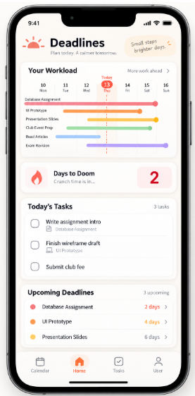
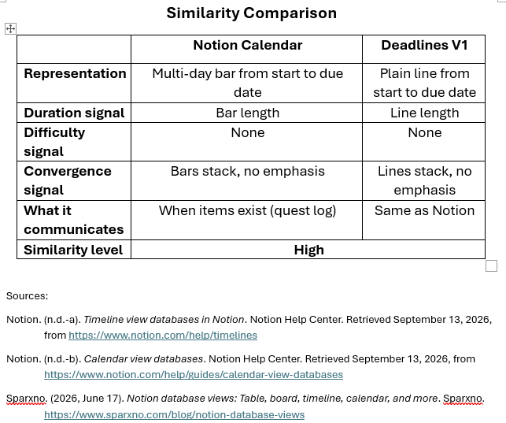
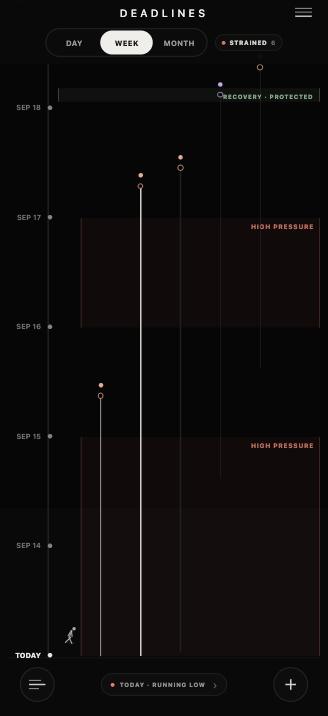
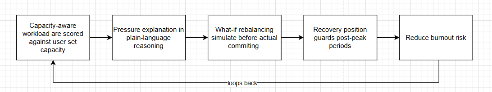
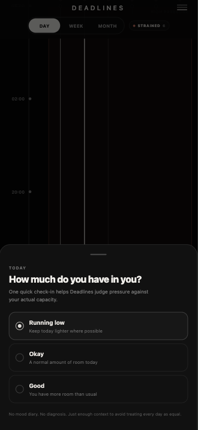
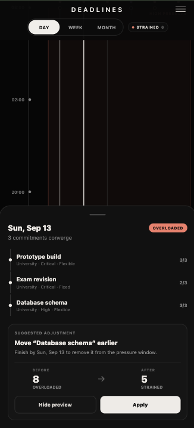
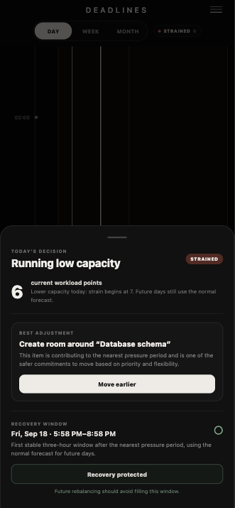

# Deadlines by Team Code Happens

<p align="center">
  
</p>

> **See the pressure coming. Adjust before it hits.**

**Team:** Chloe Chok, Daniel Yong, Evan Chong  
**Problem Statement:** Lifestyle Track — Beating the Burnout: Stress & Workload Manager  
**Video Presentation:** [View Youtube Presentation](https://youtu.be/vPrdtvjB_Mo)  
**Presentation Slides:** [View Canva presentation](https://www.canva.com/design/DAHU9VZ4Qj4/w_xteARCwS-PP3a84dTFcg/edit)  
**UI Prototype:** [prototype screenshots](#3-design--prototype)

---

# 1. Project Overview

## The Problem

University students rarely burn out because of one single task. Pressure accumulates across assignments, exams, part-time work, projects, errands, social commitments and personal responsibilities until the combined workload becomes difficult to see and harder to control.

Calendars and task managers show **what** needs to be done and **when**, but students still have to mentally estimate the combined strain created by overlapping commitments. By the time overload becomes obvious, they may already be exhausted.

Our main stakeholders are university students balancing academic work with other responsibilities. We focus on three gaps: workload becomes visible too late, prioritisation becomes reactive, and existing tools can describe pressure without helping the user decide what can realistically change.

## Our Solution

**Deadlines** is a mobile-first workload forecasting and rebalancing tool. It turns commitments into a visual timeline, detects periods where difficult responsibilities converge, adapts today's interpretation to the user's available capacity, and helps the user make a realistic adjustment before pressure becomes burnout.

The core loop is **See → Understand → Adjust → Recover**.

### Feature Set

- Day / Week / Month visual workload timeline
- Manageable, Busy, Strained and Overloaded pressure forecasting
- Daily capacity check-in: Running Low / Okay / Good
- Pressure-zone drill-down showing contributing commitments
- Category, priority, difficulty and flexibility metadata
- Explainable what-if rebalancing preview before changes are applied
- Recovery-window identification and protection
- Commitment creation, details and completion
- Planned Outlook / Teams / calendar ingestion for lower manual effort
- Planned meaningful notifications/widgets for a low-attention experience

---

# 2. Ideation & Process

## 2.1 Ideas We Considered

| Idea | Why it was dropped / kept |
| --- | --- |
| **Workload pressure timeline (Chosen)** | **Kept.** Makes workload convergence visible across time and became the core interaction. |
| **Pressure forecasting (Chosen)** | **Kept.** Shows *when* workload becomes difficult rather than only counting tasks. |
| **What-if rebalancing (Chosen)** | **Kept.** Turns the product from a passive visualiser into a decision-support tool. |
| **Daily capacity check-in (Chosen)** | **Kept.** The same objective workload can feel different depending on the user's available capacity that day. |
| **Recovery protection (Chosen)** | **Kept.** Responds directly to the need to move users toward recovery, not only productivity. |
| **Runner metaphor (Chosen, simplified)** | **Kept but simplified.** Early versions used multiple runners. This was ambiguous, so the concept evolved toward one runner representing the user's aggregate strain. |
| Simple deadline lines | **Dropped as the final concept.** Too similar to conventional calendar/timeline products and did not explain strain. |
| Generic stress / mood tracker | **Dropped as the core.** It reports how the user already feels but does not sufficiently predict or rebalance future workload. |
| Full AI task planner | **Deferred.** Too broad and opaque for the MVP. We use a deterministic workload engine so decisions remain explainable. |
| Heavy gamification | **Dropped.** XP, levels and rewards risked making workload management another obligation. |
| Outlook / Teams / calendar sync | **Future scope.** Valuable for reducing manual entry, but not required to prove the core prototype loop. |
| Widgets / lock-screen status | **Future scope.** Fits the low-attention vision but is outside the prototype build scope. |

## 2.2 Ideation Boards

The board shows the evolution, not only the final UI — from problem framing to the decision-support layer. Sequence follows the recommended structure.

### 1 — Problem Tree: why invisible workload

<p align="center">
  
</p>

*We mapped burnout to four contributors — visible deadlines already tracked, invisible workload that accumulates unseen, poor sleep/routines, and social pressure. Existing apps handled visible deadlines best. We chose to focus on **invisible accumulated workload** — the stack that becomes obvious only when it is already overwhelming.*

### 2 — V1: Commitments as Deadline Lines

<p align="center">
  
</p>

*V1 rendered each commitment as a horizontal line from start to due date (Your Workload / Days to Doom / Today's Tasks / Upcoming Deadlines). It communicated **when** items existed, similar to a quest log, but treated every line equally. Duration was visible as line length; difficulty, convergence and lived strain were not.*

### 3 — Competitor / Similarity Realisation

<p align="center">
  
</p>

*We audited V1 against Notion Calendar/Timeline. Both used a multi-day bar/line from start to due date, bar/line length for duration, no difficulty signal, and lines/bars that stack without emphasis. Communication was “when items exist”. Similarity was **High** — not differentiated enough from conventional calendars. This forced a pivot from “deadline visualiser” to “workload forecasting and decision support”.*

Sources: Notion (n.d.-a). *Timeline view databases in Notion.* Notion Help Center; Notion (n.d.-b). *Calendar view databases.* Notion Help Center; Sparxno (2026, June 17). *Notion database views: Table, board, timeline, calendar, and more.*

### 4 — V2: Workload as Lived Strain

<p align="center">
  
</p>

*V2 verticalises time and introduces **pressure zones** (HIGH PRESSURE blocks), deadline **convergence dots** at the top of each commitment line, and the **runner** on the left gutter whose fatigue matches the workload band. The question shifts from “what is due?” to “when does combined strain become dangerous and why?”.*

### 5 — Prototype Simplification: Less Clutter, One Runner

<table>
  <tr>
    <td align="center"><br/><sub>V2 — exploratory, multiple accents</sub></td>
    <td align="center"><br/><sub>Prototype — simplified</sub></td>
  </tr>
</table>

*We removed multi-runner ambiguity, hid task labels until interaction, kept **category accents** as dot colour only, and kept **one runner** representing aggregate user strain. Pressure zones and the capacity pill (“STRAINED · 8”) carry visual weight instead of dashboard cards. Tap a HIGH PRESSURE region to drill into the contributing commitments (see Pressure Interaction in §3). The result is quieter at rest and explicit on demand.*

### 6 — Decision Layer: Capacity-Aware, Explainable, Recovery-Protected

<p align="center">
  
</p>

*The loop closes as **See → Understand → Adjust → Recover**:* (1) *workload is scored against a **user-set daily capacity** (Running Low / Okay / Good — not a mood diary);* (2) *pressure is explained in plain language with the commitments that create it;* (3) *a **what-if rebalancing** is simulated before committing — e.g. moving a flexible commitment earlier, with BEFORE 8 OVERLOADED → AFTER 5 STRAINED preview;* (4) *a **recovery window** after the nearest pressure period is identified and can be protected from refilling, guarding the post-peak dip. The loop reduces burnout risk.*

<table>
  <tr>
    <td align="center"><br/><sub>Daily capacity check-in</sub></td>
    <td align="center"><br/><sub>Pressure drill-down + suggested move</sub></td>
    <td align="center"><br/><sub>What-if preview + recovery protection</sub></td>
  </tr>
</table>

*Concept evolution summary: the product moved from a **deadline visualiser** (V1 lines, quest-log feel) to a **workload forecasting and decision-support system** (V2 + decision layer) that makes accumulated strain visible early enough to act, and protects recovery instead of treating empty time as free capacity.*

## 2.3 Mentor Consultation

| Date | Mentor | Feedback Received | What Was Changed |
| --- | --- | --- | --- |
| 13 Sep 2026 | Janelle Tan | Design is innvoative but can be confusing at first | Refine the UI design to be more intuitive. Consider to add on-board tutorial and make it always accessible at any given point |
| 13 Sep 2026 | Janelle Tan | Presentation slides focus on Deadlines app itself, not so on the build plan | Changed presentation script to focus more for Deadlines |
| 13 Sep 2026 | Janelle Tan | Student might forget to update their energy, tireness level in Deadlines app | Make the energy updating system to be automated. Consider using pop-up to inform students to update their energy level |

---

# 3. Design & Prototype

The prototype deliberately keeps the timeline as the primary surface instead of surrounding the user with dashboard cards. Task labels stay visually quiet until interaction, while pressure zones and decisions receive stronger visual priority.

### Prototype Screens

<table>
  <tr>
    <td align="center"><br/><sub><b>Workload Timeline</b><br/>Upcoming commitments and pressure zones.</sub></td>
    <td align="center"><br/><sub><b>Day View</b><br/>Focused view of the student's current workload.</sub></td>
  </tr>
  <tr>
    <td align="center"><br/><sub><b>Pressure Interaction</b><br/>Inspect the commitments contributing to pressure.</sub></td>
    <td align="center"><br/><sub><b>Decision Support</b><br/>Preview adjustments before applying them.</sub></td>
  </tr>
</table>

### Key Prototype Interactions

1. **Timeline:** switch between Day, Week and Month to see workload accumulate.
2. **Daily capacity:** Running Low / Okay / Good changes today's workload sensitivity without becoming a mood diary or diagnosis.
3. **Pressure drill-down:** tap a high-pressure region to see which commitments contribute to it.
4. **Rebalancing preview:** preview workload before → after moving a safer flexible commitment, then explicitly apply it.
5. **Recovery protection:** identify lower-load time after a pressure period and protect it instead of automatically filling it.
6. **Commitment management:** add commitments with due date/time, category and priority; inspect details and mark completed work so it leaves the active timeline.

---

# 4. What Makes It Different

Deadlines is not primarily a task manager, calendar or stress journal. Its central object is **future workload pressure**.

| Conventional approach | Deadlines |
| --- | --- |
| Shows individual tasks/events | Shows how commitments combine into workload |
| Deadline reminder | Forecasts pressure before commitments converge |
| Static priority | Uses priority, difficulty, flexibility and daily capacity |
| Reports stress/task count | Explains which commitments create the pressure |
| Suggests productivity | Previews a concrete rebalance before applying it |
| Treats empty time as unused capacity | Can protect lower-pressure time as recovery |

### Novel Features / Twists

**Workload as lived strain.** The timeline represents cumulative strain, not only task information.

**Capacity-aware interpretation.** A lightweight daily check changes today's thresholds, distinguishing objective workload from how much room the user has today.

**Explainable what-if rebalancing.** Deadlines does not automatically rearrange the user's life. It identifies movable work, explains the suggestion, previews the effect and leaves the decision with the user.

**Recovery as protected capacity.** A low-load period is not automatically treated as space for more work; it can be protected for recovery.

> **Most productivity tools tell you what you need to do. Deadlines shows what all of those commitments are doing to you collectively — early enough to change it.**

---

# 5. Technical Architecture & Feasibility

## Tech Stack

| Layer | Technology | Why / constraints |
| --- | --- | --- |
| Mobile client | **React Native + Expo 57 + TypeScript** | One mobile-first codebase for iOS and Android, with access to native components and Expo tooling. |
| Workload logic | **Deterministic TypeScript engine** | Explainable, testable workload scoring without depending on opaque AI output. |
| Backend/API | **FastAPI (Python), planned service layer** | Suitable for later automation, integrations and advanced processing. Core prototype calculations remain local. |
| Database/Auth | **Supabase / PostgreSQL** | Practical hosted persistence/auth foundation with low prototype setup overhead. |
| Integrations | **Outlook / Teams / calendar APIs — planned** | Reduces duplicate manual entry; OAuth, permissions and provider normalisation remain future integration work. |
| Mobile build & distribution | **Expo Application Services (EAS)** | Produces native Android/iOS builds for device testing and future store distribution. |

## Workload Engine

Each active commitment contributes a difficulty weight:

| Difficulty | Weight |
| --- | ---: |
| Easy | 1 |
| Medium | 2 |
| Hard | 3 |

The engine combines active commitment load and detects periods where the score crosses a pressure threshold. Daily capacity can make today's thresholds more or less sensitive. The resulting states are **Manageable, Busy, Strained and Overloaded**.

The rebalancing layer then looks for safer movable commitments using flexibility and priority, previews the proposed change and leaves final control with the user.

## System Architecture

```text
                   DEADLINES MOBILE APP
              React Native + Expo + TypeScript
                          │
              ┌───────────┼───────────┐
              │           │           │
              ▼           ▼           ▼
       ON-DEVICE       SUPABASE     FASTAPI
       WORKLOAD        Auth + DB    [Optional /
        ENGINE                      Next Phase]
              │                       │
      scoring / pressure        External APIs
      capacity / rebalance      Outlook / Teams
      recovery decisions        Calendar / LMS
```

## Build Plan & Scope

### Prototype / Current Scope

- Day / Week / Month workload timeline
- Commitment creation and completion
- Category, priority, difficulty and flexibility metadata
- Deterministic workload scoring
- Daily capacity-aware thresholds
- High-pressure period detection
- Pressure-zone explanation
- What-if rebalancing preview and apply action
- Recovery-window protection interaction
- Expo development build / physical-device demonstration

### Next Build Phase

- Persist user data and preferences through Supabase
- Authentication and per-user data separation
- Outlook / Teams / calendar ingestion
- User-configurable module priorities
- Native workload-change notifications
- Home/Lock Screen widgets and quick actions
- Stronger recovery/recommendation rules
- EAS preview builds, wider device testing and accessibility refinement

### Scope Decision

We intentionally did **not** build an AI chatbot, full calendar replacement, clinical mental-health tracker or autonomous scheduling agent for the prototype. A narrower scope lets us demonstrate the challenge's central requirement clearly: **make accumulated workload visible, help the student rebalance it, and preserve room for recovery before burnout hits.**

---

## Running the Prototype

Install dependencies and start the Expo development server:

```bash
npm install
npx expo start
```

Open the project on an iOS or Android device through Expo Go / an Expo development build.

For a future installable device build, Deadlines is designed to use **Expo Application Services (EAS)** to produce native Android and iOS builds.

---
